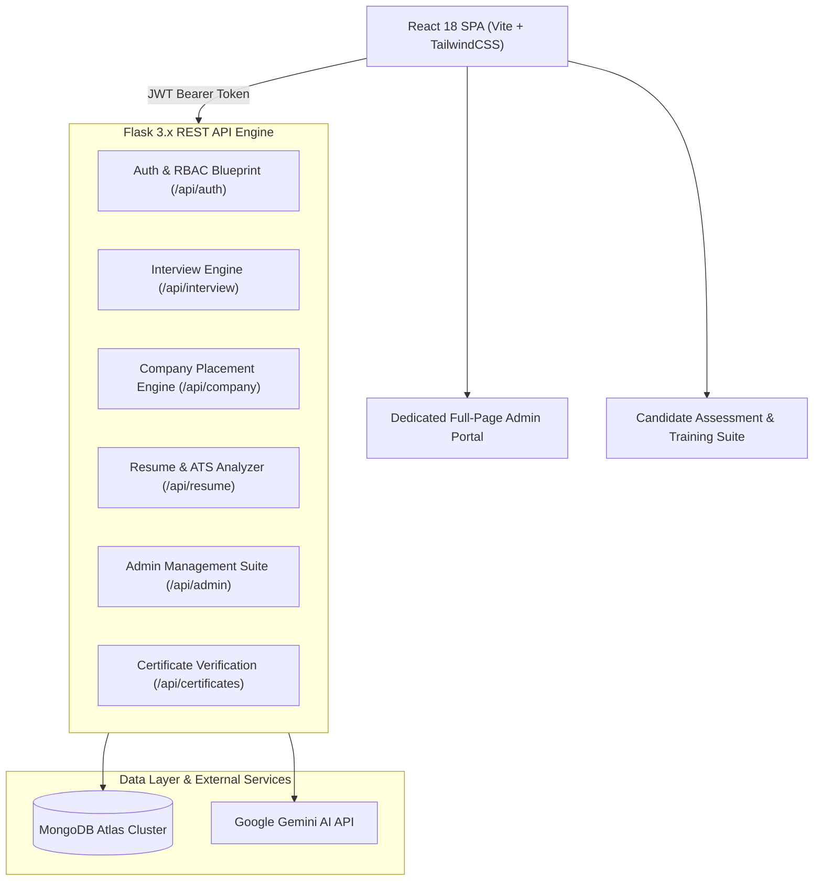

<div align="center">

# 🤖 AI Interview Trainer & Career Placement Engine

**A production-ready, full-stack AI career preparation platform that simulates real multi-round corporate technical interviews, evaluates resumes with a 24-step ATS engine, generates live coding challenges in Monaco editor, and provides an end-to-end dedicated Administrator Portal.**

<br/>

[](https://github.com/avinashbasani132/ai-interview-trainer)
[](https://www.python.org/)
[](https://flask.palletsprojects.com/)
[](https://react.dev/)
[](https://www.mongodb.com/atlas)
[](https://ai.google.dev/)

<br/>

[](#-ats-resume-analyzer--24-step-pipeline)
[](#-company-based-placement-engine-33-mncs)
[](#-dedicated-full-page-administrator-portal)
[](#-security--authentication)

</div>

---

## 📖 Overview

**AI Interview Trainer** is designed to bridge the preparation gap for software engineering candidates aiming for top-tier tech companies. It provides:

1. 🎯 **Standard 4-Round Assessment Track** — Aptitude MCQ $\rightarrow$ Adaptive Tech AI $\rightarrow$ Monaco Coding Arena $\rightarrow$ HR Video Communication Round with full-page result analytics.
2. 🏢 **33-Company Placement Drives** — Multi-round hiring simulators calibrated for Google, Microsoft, Amazon, Meta, Apple, Netflix, Uber, TCS, Infosys, Wipro, and high-growth startups.
3. 📄 **Resume-Based Adaptive AI Interview** — Deep interview questions tailored dynamically to the candidate's exact resume projects, tools, and technical background.
4. 🛠️ **Dedicated Full-Page Administrator Portal** — Centralized controls, 33-company question banks, live candidate telemetry, certificate manager, and audit logs.
5. 📄 **Deterministic 24-Step ATS Resume Analyzer** — Instant score breakdown, keyword matching, and section-by-section enhancement tips.
6. 💻 **Live Coding Arena with Monaco Editor** — Real-time execution, test case verification, and multi-language support.
7. 📜 **Tamper-Proof Verification Certificates** — SHA-256 digital signature certificates with public verification URLs.

---

## 🏛️ System Architecture



---

## ✨ Feature Modules

### 🎯 1. Standard 4-Round Interview Track
| Round | Format | Time Limit | Pass Benchmark | Details |
| :--- | :--- | :--- | :--- | :--- |
| **Round 1** | Aptitude MCQ | 30 Mins | $\ge 60\%$ | 25 questions covering Quantitative, Logical Reasoning & CS basics |
| **Round 2** | Technical AI Interview | 15–20 Mins | $\ge 70\%$ | 5 adaptive Gemini AI questions tailored to responses |
| **Round 3** | Live Coding Arena | 30 Mins | $\ge 70\%$ | Monaco editor with real-time test case verification |
| **Round 4** | HR Video Round | 10 Mins | $\ge 70\%$ | Video/audio recording evaluated on STAR communication criteria |

- **Full-Page Result Screen**: Shows animated score percentage, pass/fail status, topic mastery, and full question-by-question review with explanations.

---

### 🏢 2. Company-Based Placement Engine (33 MNCs)
Simulate official recruitment cycles across Product Giants, Tech MNCs, Startups, and Services:
- **Companies Supported**: Google, Microsoft, Amazon, Meta, Apple, Netflix, Uber, TCS, Infosys, Wipro, Accenture, Cognizant, Capgemini, Flipkart, Zomato, Swiggy, and 17 more.
- **Question Bank**: 205+ structured, online-researched interview questions across Aptitude, Technical MCQ, Coding, Technical AI, and HR rounds.
- **Interactive Player**: Real-time timer countdown, option selector, and round progression.

---

### 📄 3. Resume-Based Adaptive AI Interview
- Upload any **PDF or DOCX** resume or pick from previously parsed resumes.
- Automatically extracts technologies, projects, and difficulty level.
- Generates 5 tailored technical & project architecture questions.
- Features real-time AI evaluation feedback, hint guidance, and an end-of-session performance report.

---

### 🛡️ 4. Dedicated Full-Page Administrator Portal
A dedicated, full-screen management control suite:
- **Telemetry & Overview**: Total registered candidates, active live sessions, rounds cleared, and developer test bypass controls.
- **Company Placements (33)**: Add, edit, or remove company profiles and configure difficulty levels.
- **Question Bank Configs**: Filter questions by company and round, create new structured questions, or delete obsolete questions.
- **Registered Candidates**: Inspect candidate accounts, test history, and completed rounds.
- **Issued Credentials**: View and download candidate achievement certificates.
- **System Logs & Health**: Live audit trail of all administrative actions and security events.

---

## 🛠️ Tech Stack

| Layer | Technology |
| :--- | :--- |
| **Frontend** | React 18, Vite 8, TailwindCSS v4, Monaco Editor, Lucide Icons |
| **Backend** | Python 3.10+, Flask 3.x, Flask-CORS, Flask-JWT-Extended |
| **Database** | MongoDB Atlas (NoSQL) via MongoEngine ODM & `pymongo[srv]` |
| **AI Engine** | Google Gemini Generative AI (`google-genai`) |
| **Security** | JWT Authentication with RBAC, Bcrypt Password Hashing, TLS/SSL Certifi |
| **WSGI Servers** | Gunicorn (Linux/Cloud), Waitress (Windows) |

---

## 🚀 Local Development Setup

### Prerequisites
- **Python 3.10+**
- **Node.js 18+ & npm**
- **MongoDB Atlas Cluster** (or local MongoDB on port `27017`)

### 1. Clone Repository
```bash
git clone https://github.com/avinashbasani132/ai-interview-trainer.git
cd ai-interview-trainer
```

### 2. Backend Setup
```bash
cd backend
python -m venv venv
# On Windows:
.\venv\Scripts\activate
# On Linux/macOS:
source venv/bin/activate

pip install -r requirements.txt
```

### 3. Environment Variables Configuration
Create a `.env` file in `backend/.env`:
```env
MONGODB_URI=mongodb+srv://<username>:<password>@cluster0.mongodb.net/interview_trainer?retryWrites=true&w=majority
SECRET_KEY=interview-trainer-secure-secret-key-2026
JWT_SECRET_KEY=interview-trainer-jwt-secret-key-2026
FLASK_ENV=dev
PORT=8000
GEMINI_API_KEY=your_gemini_api_key_here
```

### 4. Database Seeding & Admin Setup
```bash
# Initialize Admin account (basani@gmail.com / 123456)
python scripts/setup_admin.py

# Seed 33 Companies, 205+ Questions, 30 Aptitude Questions, 4 DSA Problems
python scripts/seed_mongo.py
```

### 5. Start Backend Server
```bash
python app.py --port 8000
# Backend runs at http://127.0.0.1:8000
```

### 6. Frontend Setup & Run
In a separate terminal:
```bash
cd frontend-react
npm install
npm run dev
# Frontend runs at http://localhost:5173
```

---

## ☁️ One-Click Cloud Deployment

### 🌟 Deploy to Render (Recommended)

1. Sign up at [render.com](https://render.com) and link your GitHub account.
2. Click **New +** $\rightarrow$ **Web Service** and select `avinashbasani132/ai-interview-trainer`.
3. Configure the following fields:
   - **Build Command**: `pip install -r requirements.txt && npm --prefix frontend-react install && npm --prefix frontend-react run build`
   - **Start Command**: `gunicorn --chdir backend "app:create_app()" --bind 0.0.0.0:$PORT --workers 2 --timeout 120`
4. Add the following **Environment Variables** in Render:
   - `MONGODB_URI`: Your MongoDB Atlas URI
   - `SECRET_KEY`: `interview-trainer-secure-secret-key-2026`
   - `JWT_SECRET_KEY`: `interview-trainer-jwt-secret-key-2026`
   - `FLASK_ENV`: `production`
   - `GEMINI_API_KEY`: *(Optional)* Your Google Gemini API Key
5. Click **Deploy Web Service**!

---

## 🔑 Default Administrator Credentials

| Field | Value |
| :--- | :--- |
| **Portal URL** | [http://localhost:5173](http://localhost:5173) |
| **Email** | `basani@gmail.com` |
| **Password** | `123456` |
| **Role** | System Administrator (Auto-redirects to Full-Page Admin Portal) |

---

## 🧪 Testing & Verification

Run automated test suites and linters:
```bash
# Backend Automated Tests
cd backend
python tests/run_all_tests.py

# Python Linting
flake8 . --count --select=E9,F63,F7,F82,F401,F841

# Frontend Linting & Production Build
cd ../frontend-react
npx oxlint --format unix
npm run build
```

---

## 📄 License
Distributed under the MIT License. See `LICENSE` for more information.
